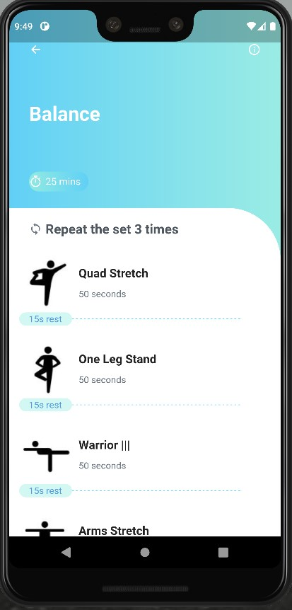

# Shape-Up

- Name and Surname: Asel Esra Ozyilmaz
- Email: esra.ozyilmaz@iaau.edu.kg
- Computer Science Department of Alatoo International University.
- Individual midterm project for CS 303: Mobile App Development class.

## Description Of The Project

Shape Up mobile app, created in Android studio with the help of dart language and flutter sdk, is a gym app which helps its users to get in shape and to maintain a healthy lifestyle. It can display 5 different screens which are home_page, aerobic, strength, balance and flexibility classes. From home_page class we can navigate to other 4 classes. For simulation of the project an AVD manager tool(Pixel 3 XL API 30) is used.

### This is how the main page looks;

 

` These 4 Exercise types are inside an Expanded widget which is scrollable  `

### Aerobic, Strength, Balance and  Flexibility classes

 

### Navigation

We have 4 navigating routes in our main page which are the names of each exercise type, when clicked on them we are navigated to the desired page. 

Except the main page other 4 pages have an 'arrow back' icon and when clicked on it we are taken back to our main page. 

